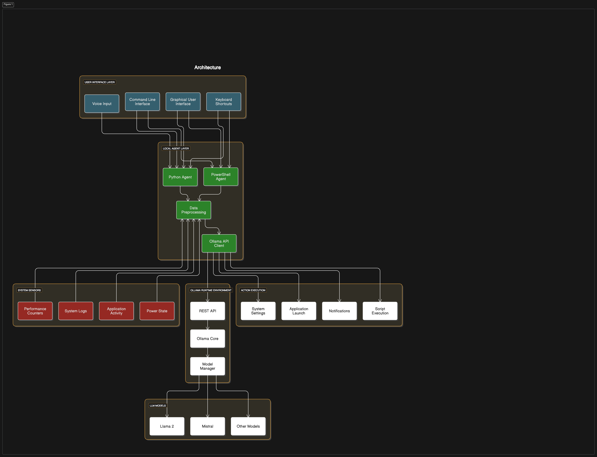

# AI Smart Laptop Management

An intelligent system that uses local LLMs (via Ollama) to monitor and manage Windows laptop resources, providing smart recommendations and automated actions based on system state.

## Architecture




## Components

- **User Input**: CLI interface for user commands and requests
- **Local Agent**: Core Python application that orchestrates the workflow
- **Ollama**: Local LLM runtime environment
- **Data Processing**: Transforms raw sensor data for LLM consumption
- **System Sensors**: Collects Windows system metrics and state
- **Action Execution**: Performs system actions based on LLM recommendations

## Installation

### Prerequisites

- Python 3.8 or higher
- Windows 10/11
- [Ollama](https://ollama.ai/) installed and running

### Setup

1. Clone this repository:
   ```
   git clone -b develop https://github.com/yourusername/ai-smart-laptop-management.git
   cd ai-smart-laptop-management
   ```

2. Install dependencies:
   ```
   pip install -r requirements.txt
   ```

3. Pull a compatible LLM model with Ollama:
   ```
   ollama pull llama3
   ```
   (You can use other models like mistral, phi, etc.)

## Usage

### Command Line Interface

Run the application in CLI mode:

```
python local_agent.py
```

Example commands:
- "What's the current state of my laptop?"
- "Close Chrome if it's using too much memory"
- "Show me the top resource-intensive processes"
- "Set power plan to balanced"

### Background Service

Run as a background service that periodically checks system state:

```
python local_agent.py --background
```

### Configuration

You can customize settings by editing `config.json` (created on first run):

```json
{
    "llm_model": "llama3",
    "api_base": "http://localhost:11434",
    "system_check_interval": 60,
    "log_level": "INFO"
}
```

## Features

- Real-time system monitoring (CPU, memory, disk, battery)
- Intelligent resource management recommendations
- Automatic actions for critical system conditions
- Natural language interface for system management
- Local processing with no data sent to external services

## License

MIT